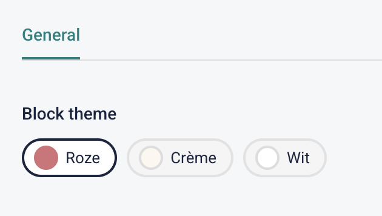
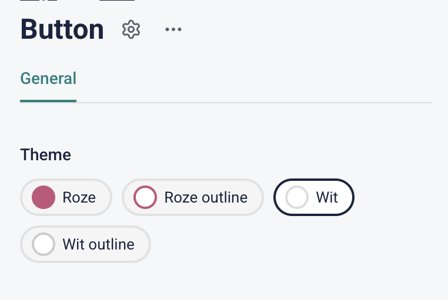

# Storyblok Theme Picker Field Plugin

A visual theme picker field plugin for [Storyblok](https://www.storyblok.com/). Replaces plain text dropdowns with colored chips for an intuitive editing experience.




## Features

- Horizontal chip row with colored circles and labels
- Visual selected state (ring highlight)
- Light color detection — white/light colors get a subtle border so they remain visible
- Fully generic — all options come from field config JSON, nothing is hardcoded
- CSS custom properties for easy theming of the plugin UI
- Stores a single string value (backward-compatible with existing "Single Option" fields)

## Installation

### Deploy to Storyblok

1. Clone the repo and install dependencies:

```bash
git clone https://github.com/dariusrosendahl/storyblok-theme-picker.git
cd storyblok-theme-picker
pnpm install
```

2. Create a `.env.local` file with your Storyblok personal access token:

```bash
cp .env.local.example .env.local
# Edit .env.local and set STORYBLOK_PERSONAL_ACCESS_TOKEN
```

3. Build and deploy:

```bash
pnpm run deploy
```

### Configure a Field

In Storyblok, change a field type to use this plugin and add an `options` key in the field's plugin options containing a JSON array:

```json
[
  { "value": "bg-primary", "label": "Roze", "color": "#D47178" },
  { "value": "bg-cream", "label": "Crème", "color": "#FDF8F0" },
  { "value": "bg-white", "label": "Wit", "color": "#FFFFFF" }
]
```

Each option has:

| Property | Description |
|----------|-------------|
| `value` | The string stored in Storyblok (e.g. `"bg-primary"`) |
| `label` | Display label shown next to the color circle |
| `color` | Hex color for the circle background (e.g. `"#F9A8D4"`) |
| `borderColor` | *(optional)* Hex color for the circle border — useful for outline-style options |

## Example Configurations

### Background themes

```json
[
  { "value": "bg-primary", "label": "Roze", "color": "#D47178" },
  { "value": "bg-cream", "label": "Crème", "color": "#FDF8F0" },
  { "value": "bg-white", "label": "Wit", "color": "#FFFFFF" },
  { "value": "bg-dark", "label": "Donker", "color": "#1B243F" }
]
```

### Button themes

```json
[
  { "value": "btn-primary", "label": "Roze", "color": "#C4547A" },
  { "value": "btn-outline", "label": "Roze outline", "color": "#FFFFFF", "borderColor": "#C4547A" },
  { "value": "btn-white", "label": "Wit", "color": "#FFFFFF" },
  { "value": "btn-white-outline", "label": "Wit outline", "color": "#FFFFFF", "borderColor": "#CCCCCC" }
]
```

## Development

```bash
pnpm install
pnpm dev
```

Then open the [Storyblok Sandbox](https://plugin-sandbox.storyblok.com/field-plugin/) to preview the plugin. The sandbox options are loaded from `field-plugin.config.json`.

## Theming

The plugin UI uses CSS custom properties. Override them to customize the look:

```css
:root {
  --stp-chip-bg: #f5f5f5;           /* Chip background */
  --stp-chip-bg-selected: #ffffff;   /* Selected chip background */
  --stp-chip-border: #e2e2e2;        /* Chip border (unselected) */
  --stp-chip-border-selected: #1B243F; /* Chip border (selected) */
  --stp-chip-radius: 999px;         /* Chip border radius */
  --stp-chip-padding: 4px 12px 4px 8px; /* Chip padding */
  --stp-chip-gap: 6px;              /* Gap between circle and label */
  --stp-circle-size: 16px;          /* Color circle diameter */
  --stp-circle-border: #dddddd;     /* Border for light colors */
  --stp-label-color: #1B243F;       /* Label text color */
  --stp-label-size: 13px;           /* Label font size */
  --stp-container-gap: 8px;         /* Gap between chips */
}
```

## License

MIT
